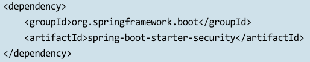
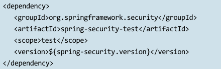
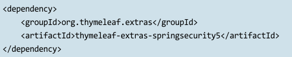
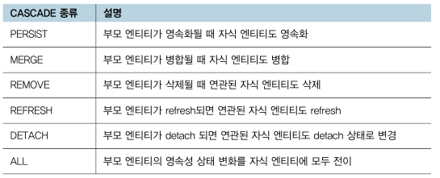
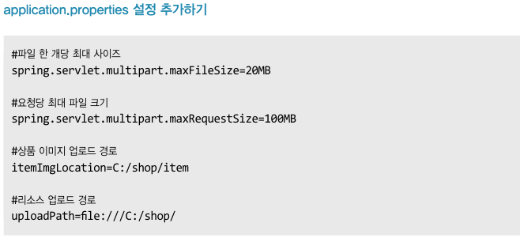

# 스프링 부트 쇼핑몰 프로젝트 with JPA 학습 Repository

## 1장 개발 환경 구축

### 1.1 스프링 부트의 특징

### 1.2 JDK 설치

### 1.3 인텔리제이 설치

### 1.4 애플리케이션 실행하기

1.4.1 Spring Boot Project 생성하기
  
1.4.2 빌드 도구

1.4.3 설정 파일 (application.propertes)
  
1.4.4 Hello World 출력하기
  
### 1.5 Lombok 라이브러리
 
### 1.6 MySQL 설치하기

## 2장 Spring Data JPA

### 2.1 JPA

2.1.1 JPA란?

* 객체지향과 관계형 데이터베이스 간의 패러다임이 불일치하기 때문에 해결하기 위해서 나온 기술이 ORM
* JPA는 ORM 기술의 표준 명세로 자바에서 제공하는 API, 즉 JPA는 인터페이스고 이를 구현한 대표적인 구현체로는 Hibernate, EclipseLink, DataNucleus, OpenJpa, TopLink

2.1.2 JPA 동작 방식

* 엔티티
    
    데이터베이스이 테이블에 대응하는 클래스

* 엔티티 매니저 팩토리

    엔티티 매니저 인스턴스를 관리하는 주체이며 애플리케이션 실행 시 한 개만 만들어지며 사용자로부터 요청이 오면 엔티티 매니저 팩토리로부터 엔티티 매니저를 생성
    
* 엔티티 매니저

    영속성 컨텍스에 접근하여 엔티티에 대한 데이터베이스 작업을 제공하며 내부적으로 데이터베이스 커넥션을 사용해서 데이터베이스 접근
    find, persist, remove, flush 메소드

* 영속성 컨텍스트

    엔티티를 영구 저장하는 환경으로 엔티티 매니저를 통해 영속성 컨텍스트에 접근
    
    

    [영속성 컨텍스트 사용 시 이점]

    * 1차 캐시

        영속성 컨텍스트에는 1차 캐시가 존재하며 Map<KEY, VALUE>로 저장
        
    * 동일성 보장

        하나의 트랜잭션에서 같은 키값으로 영속성 컨텍스트에 저장된 엔티티 조회 시 같은 엔티티 조회를 보장 (1차 캐시에 저장된 엔티티를 조회)
        
    * 트랜잭션을 지원하는 쓰기 지연

        persist() 호출하면 1차 캐시에 저장되는 것과 동시에 쓰기 지연SQL 저장소에 SQL문이 저장, flush 되면서 데이터베이스에 반영 (성능 이점)
        
    * 변경 감지

        1차 캐시에 저장된 엔티티와 스냅샷을 비교 후 변경 내용이 있다면 UPDATE SQL문을 쓰기 지연SQL 저장소에 담아두고 커밋 시점에 변경 내용을 자동 반영 (Update문 호출 필요 없음)

### 2.2 쇼핑몰 프로젝트 생성하기

2.2.1 프로젝트 생성

    https://start.spring.io/ 접속하여 프로젝트 생성 (패키지 이름 com.shop)
    Lombok, Thymeleaf, Spring Data JPA, Spring Web, MySQL Driver, H2 Database 의존성 추가

2.2.2 application.properties 설정하기

    application.properties 주석 정리
    데이터베이스 초기화 전략 - DDL AUTH 옵션
    
### 2.3 상품 엔티티 설계하기

2.3.1 상품 엔티티 설계하기

    com.shop.entity 패키지 생성
    com.shop.entity.item.javs 생성
    com.shop.constant 패키지 생성 (enum 타입 모음)
    com.shop.constant.ItemSellStatus.java 생성

  

  

  

### 2.4 Repository 설계하기

    com.shop.repository 패키지 생성 후 ItemRepository 인터페이스 생성
    테스트 환경 시 h2 데이터베이스를 사용하도록 resources 아래에 application-test.properties 파일 생성
    ItemRepository 인터페이스에서 Test 생성 (ItemRepsotiroyTest)

### 2.5 쿼리 메소드

  

    - 상품의 이름을 이용하여 데이터를 조회하는 예제
        ItemRepository 인터페이스에 findByItemNm 메소드 추가
        ItemRepositoryTest 에 Test 코드 작성
        
    - OR 조건 처리 예제
        ItemRepository 인터페이스에 findByItemNmOrItemDetail 메소드 추가
        ItemRepositoryTest 에 Test 코드 작성
    
    - LessThan 조건 처리 예제
        ItemRepository 인터페이스에 findByPriceLessThan 메소드 추가
        ItemRepositoryTest 에 Test 코드 작성
        
    - OrderBy 정렬 처리 예제
        ItemRepository 인터페이스에 findByPriceLessThanOrderByPriceDesc 메소드 추가
        ItemRepositoryTest 에 Test 코드 작성

### 2.6 Spring DATA JPA @Query 어노테이션

    - @Query 어노테이션을 이용하면 SQL과 유사한 JPQL 이라는 객체지향 쿼리 언어를 통해 복잡한 쿼리도 처리 가능
    - JPQL 은 엔티티 객체를 대상으로 쿼리를 수행하는 객체지향 쿼리
    - SQL 을 추상화해서 사용하기 때문에 특정 데이터베이스 SQL 에 의존하지 않아 데이터베이스가 변경되어도 애플리케이션 영향을 받지 않
    - 검색 예제
        ItemRepository 인터페이스 findByItemDetail 메소드 추가
        ItemRepositoryTest 에 Test 코드 작성
        
### 2.7 Spring DATA JPA Querydsl

    - 작성 쿼리 중 오타가 들어갈 경우 애플리케이션을 실행하기 전까지 오류를 인지하지 못하며, 로딩 시점에 파싱 후 에러를 잡도록 도음을 주는 것이 Querydsl
    - Querydsl 은 JPQL 을 코드로 작성할 수 있도록 도와주는 빌더 API
    
    [Querydsl 장점]
    
    * 고정된 SQL 문이 아닌 조건에 맞게 동적으로 쿼리 생성
    * 비슷한 쿼리를 재사용할 수 있으며 제약 조건 조립 및 가독성을 향상
    * 문자열이 아닌 자바 소스코드로 작성하기 때문에 컴파일 시점에 오류를 발견
    * IDE 의 도움을 받아서 자동 완성 기능을 이용할 수 있기 때문에 생산성 향상
    
    [기본셋팅]
    * 사용을 위해 querydsl-jpa, querydsl-apt 의존성 추가
    * Maven -> Reload All Maven Projects
    * maven compile 더블 클릭 > target/generated-sources 폴더에 QItem 클래스 생성
    
    - JPAQueryFactory 이용한 상품 조회 예제
      ItemRepositoryTest 에 Test 코드 작성

  

      ItemRepository 인터페이스에 QueryDslPredicateExecutor 인터페이스 상속
      
  

      
## 3장 Thymeleaf 학습하기

### 3.1 Thymeleaf 소개

    - 서버 사이트 템플릿 엔진으로는 Thymeleaf (스프링 권장), Freemarker, Groovy, Mustache 등이 존재
    - Thymeleaf 의 가장 큰 장점은 'natural templates'
    - Thymeleaf 의 확장자명은 html 이며, 문법은 html 태그 안쪽에 속성으로 사용
    
    com.shop 패키지 아래 controller 패키지 생성 후 Thymeleaf 예제용 컨트롤러 클래 ThymeleafExController 생성
    resources/templates 아래 thymeleafEx 폴더 생성 후 해당 폴더에 thymeleafEx01.html 파일 생성 (th:text="${data}")
    
### 3.2 Spring Boot Devtools

    - Spring Bot Devtools 는 애플리케이션 개발 시 유용한 기능들을 제공하는 모듈이며 개발 생산성 향상에 도움
    
    [Spring Boot Devtools 에서 제공하는 대표적인 기능]
    
    * Automatic Restart: classpath 에 있는 파일이 변경될 때마다 애플리케이션을 자동으로 재시작
    * Live Reload: 정적 자원(html, css, js) 수정 시 새로 고침 없이 바로 적용
    * Property Defaults: Thymeleaf 는 기본적으로 성능을 향상시키기 위해서 캐싱 기능을 사용하지만 개발 시 cache 기본값을 false 로 설정 가능
    
    - spring-boot-devtools 의존성 추가
    
3.2.1 Automatic Restart 적용하기

    - 설정법이 바뀜
    
    https://velog.io/@jodawooooon/IntelliJ-%EC%9E%90%EB%8F%99-%EB%B9%8C%EB%93%9C-%EC%84%A4%EC%A0%95-%EB%B0%A9%EB%B2%95-Registry%EC%97%90-compiler.automake.allow.when.app.running%EC%9D%B4-%EC%97%86%EB%8A%94-%EA%B2%BD%EC%9A%B0
    
3.2.2 Live Reload 적용하기

    - application.properties Live Reload 적용 설정 추가
        spring.devtools.livereload.enabled=true
    - 구글 크롬 웹 스토어에서 LiveReload 설치

3.2.3 Property Defaults 적용하기

    - 운영환경과 개발 환경의 application.properties 분리 후 운영환경에서는 캐싱 기능을 사용하고, 개발환경에서는 캐싱 기능을 꺼두는 방법으로 관리
      spring.thymeleaf.cache = false

### 3.3 Thymeleaf 예제 진행하기

3.3.1 th:text 예제

3.3.2 th:each 예제

3.3.3 th:if, th:unless 예제

3.3.4 th:switch, th:case 예제

3.3.5 th:href 예제

### 3.4 Thymeleaf 페이지 레이아웃

3.4.1 Thymeleaf Layout Dialect dependency 추가하기

    - header
        resources/templates/fragments/header.html - th:fragment="header"

    - footer
        resources/templates/fragments/footer.html - th:fragment="footer"

    - layout
        resources/template/layouts/layout1.html
        th:replace="fragments/header::header"
        layout:fragments="conetnt"
        th:replace="fragments/footer::footer"
        
    - content
        resources/templates/thymeleafEx07.html - layout:fragment="content"

### 3.5 부트스트랩으로 header, footer 영역 수정하기

3.5.1 Bootstrap CDN 추가하기

3.5.2 Bootstrap Navbar Component 활용하기

## 4장 스프링 시큐리티를 이용한 회원 가입 및 로그인

    학습목표
    
    1. 스프링 시큐리티를 이용해 회원 가입 및 로그인/로그아웃 기능을 구현하는 방법을 학습한다.   
    2. 스프링 시큐리티를 이용해 회원의 역할에 따라서 페이지별 접근 권한을 부여하는 방법을 알아본다.

### 4.1 스프링 시큐리티 소개

애플리케이션의 보안에서 중요한 두 가지 영역은 '인증'과 '인가'
웹에서 인증이란 해당 리소스에 대해서 작업을 수행할 수 있는 주체인지 확인하는 것 (예. 게시판의 댓글을 작성하려면 로그인)
인가는 인증 과정 이후에 발생 (관리자 페이지 URL을 입력했을떄 관리자만 접근 가능)

### 4.2 스프링 시큐리티 설정 추가하기

4.2.1 security dependency 추가하기

스프링 시큐리티를 추가하였다면 이제 모든 요청은 인증 필요 상태
스프링 시큐리티에서 기본적으로 ㅈ공하는 아이디는 user 이고, 비밀번호는 애플리케이션을 실행할 때마다 콘솔창에 출려

    * 인증이 필요없는 경우: 삼품 상세 페이지 조회
    * 인증이 필요한 경우: 상품 주문
    * 관리자 권한이 필요한 경우: 상품 등록

4.2.2 스프링 시큐리티 설정하기

com.shop.config.SecurityConfig.javas 생성

### 4.3 회원 가입 기능 구현하기

com.shop.constant.Role.java

- 각각의 멤버는 일반 유저인지, 아니면 관리자인지 구분할 수 있는 역할 정의

com.shop.dto.MemberFormDto.java

- 회원 가입 화면으로부터 넘어오는 가입정보를 담을 dto 생성
- (테스트 완료 후) spring-boot-starter-validation 추가 후 유효성을 검증할 클래스의 필드에 어노테이션 선언

com.shop.entity.Member.js

- 회원 정보를 저장하는 Member 엔티티 생성 (이름, 이메일, 비밀번호, 주소, 역할)

com.shop.repository.MemberRepository.java

- Member 엔티티를 데이터베이스에 저장할 수 있도록 MemberRepository 생성

com.shop.service.MemberServiceTest.java

- 회원가입 기능이 정상적으로 동작하는지 테스트 코드를 작성하여 검증

[테스트 완료 후]

com.shop.controller.MemberController.java

- 회원 가입 로직을 완성했으므로, 회원 가입을 위한 페이지 생성. Controller 패키지 아래 MemberController 클래스 생성
- Post 값에 대한 검증 추가, 가입 후 main 페이지로 이동 처리
- spring-boot-starter-validation 추가

resource/templates/member/memberForm.html

- 회원 가입 UI 페이지

resource/templates/main.html

- 메인 페이지

[UI 완료 후 DB에 저장값 확인]

### 4.4 로그인/로그아웃 구현하기

4.4.1 UserDetailsService

- UserDetailService 인터페이스는 데이터베이스에서 회원 정보를 가져오는 역할을 담당
- loadUserByUsername() 메소드가 존재하며, 회원 정보를 조회하여 사용자의 정보와 궈한을 갖는 UserDetails 인터페이스를 반환

4.4.2 UserDetail

스프링 시큐리티에서 회원의 정보를 담기 위해서 사용하는 인터페이스는 UserDetails
이 인터페이스를 직접 구현하거나 스프링 시큐리티에서 제공하는 User 클래스 사용

4.4.3 로그인/로그아웃 구현하기

기존에 만들었던 MemberService 가 UserDetailService 구현

com.shop.service.MemberService.java

- UserDetailService 구현
- loadUserByUsername 메소드 작성

com.shop.config.SecurityConfig.java

- configure 메소드 작성 (로그인 관련 설정)

resources/templates/member/memberLoginForm.html

- 로그인 UI

com.shop.controller.MemberController.java

- 로그인 및 에러 페이지 메소드 작성

com.shop.controller.MemberControllerTest.java

- 로그인 성공, 실패 테스트 코드 작성

resources/templates/fragments/header.html

- 메뉴 로그인 상태 조건 처리

### 4.5 페이지 권한 설정하기

상품 등록 페이지의 경우 ADMIN 계정만 접근이 가능하고, 일반 USER 계정은 접근을 할 수 없도록 설정을 추가

resource/templates/item/itemForm.html

- ADMIN 계정만 접근할 수 있는 상품 등록 페이지 생성

com.shop.controller.ItemController.java

- 상품 등록 페이지 접근

com.shop.config.CustomAuthenticationEntryPoint.java

- 인증되지 않은 사용자가 리소스를 요청할 경우 "Unauthorized" 에러를 발생하도록 AuthenticationEntryPoint 인터페이스 구현

com.shop.controller.ItemControllerTest.java

- 현재 로그인된 계정의 Role 이 ADMIN / USER 인 경우에 대한 접근 테스트

## 5장 연관 관계 매핑

    학습목표
    
    1. 연관 관계 매핑의 종류와 엔티티 연관 관계 매핑을 설정하는 방법을 알아본다.   
    2. 매핑된 엔티티 조회 시 즉시 로딩과 지연 로딩의 차이점을 이해한다.

### 5.1 연관 관계 매핑 종류

1. 연관 관계 매핑의 종류
    * 일대일(1:1): @OneToOne
    * 일대다(1:N): @OneToMany
    * 다대일(N:1): @ManyToOne
    * 다대다(N:N): @ManyToMany

2. 엔티티를 매핑할 때는 방향성을 고려
    * 단방향
    * 양방향

5.1.1 일대일 단방향 매핑하기

com.shop.entity.Cart.java

- 장바구니 엔티티 설계
- @OneToOne/@JoinColumn 어노테이션을 이용해 회원 엔티티와 일대일 매핑

com.shop.repository.CartRepository.java

- 장바구니 엔티티 조회 레파지토리 생성

com.shop.entity.CartTest.java

- 테스트 코드 생성

    엔티티를 조회할 때 해당 엔티티와 매핑된 엔티티도 한 번에 조회하는 것을 '즉시 로딩'
    일대일(@OneToOne), 다대일(@ManyToOne) 로 매핑할 경우 즉시 로딩을 기본 Fetch 전략으로 설정
    Cart.java 클래스에서 member 엔티티와 일대일 매핑 관계를 맺어줄 때 따로 옵션을 주지 않으면 아래 코드와 같이 FetchType.EAGER (즉시 로딩)로 설정하는 것과 동일

5.1.2 다대일 단방향 매핑하기

com.shop.entity.CartItem.java

- 장바구니 아이템 엔티티 설계

5.1.3 다대일/일대다 양방향 매핑하기

    양방향 매핑이란 단방향 매핑이 2개 있다고 이해
    현재는 장바구니 상품 엔티티가 장바구니를 참조하는 단방향 매핑
    장바구니 엔티티에 장바구니 상품 엔티티를 일대다 관계로 매핑을 해준다면 양방향 매핑이 되는 것

com.shop.constant.OrderStatus.java

- 주문 도메인 엔티티 설계

com.shop.entity.Order.java

- 주문 엔티티
- 한 명의 회원은 여러 번 주문을 할 수 있으므로 주문 엔티티 기준에서 다대일 단방향 매핑

com.shop.entity.OrderItem.java

- 장바구니 상품 엔티티

5.1.4 다대다 매핑하기

    다대다 매핑은 실무에서는 사용하지 않는 매핑 관계
    관계형 데이터베이스는 정규화된 테이블 2개로 다대다를 표현할 수 없어 연결 테이블을 생성해서 다대다 관계를 일대다, 다대일 관계로 처리

### 5.2 영속성 전이

    특정 엔티티와 연관된 엔티티의 상태를 함께 변화시키는 옵션을 알아보자.

5.2.1 영속성 전이란?

    영속성 전이란 엔티티의 상태를 변경할 때 해당 엔티티와 연관된 엔티티의 상태 변화를 전파시키는 옵션
    부모는 One 에 해당하고 자식은 Many 에 해당
    Order 엔티티가 삭제되었을 때 해당 엔티티와 연관되어 있는 OrderItem 엔티티가 함께 삭제 되거나, Order 엔티티를 저장할 때 Order 엔티티에 담겨있던 OrderItem 엔티티를 한꺼번에 저장

com.shop.repository.OrderRepository.java

- 주문 레파지토리

com.shop.entity.Order.java

- orderItems 에 대해 부모 엔티티의 영속성 상태 변화를 자식 엔티티에 모두 전이하는 CascadeTypeAll 옵션을 설정

com.shop.entity.OrderTest.java

- 테스트 코드 생성

5.2.2 고아 객체 제거 하기

부모 엔티티와 연관 관계가 끊어진 자식 엔티티를 고아 객체라고 정의
영속성전이 기능과 같이 사용하면 부모 엔티티를 통해서 자식의 생명 주기를 관리

고아 객체 제거 기능은 참조하는 곳이 하나일 때만 사용해야 하며 다른 곳에서도 참조하고 있는 엔티티인데 삭제하면 문제가 생길수 있음
-> OrderItem 엔티티를 Order 엔티티가 아닌 다른 곳에서 사용하고 있다면 이 기능을 사용하면 안됨

com.shop.entity.Order.java

- @OneToMany 어노테이션에 "orphanRemoval = true" 옵션 추가

com.shop.entity.OrderTest.java

- orphanRemovalTest 메소드 작성

5.3 지연 로딩

즉시 로딩 이외에도 지연 로딩이라는 Fetch 전략

com.shop.repository.OrderItemRepository.java

- OrderItem 조회하기 위해서 JpaRepository 를 상속받는 OrderItemRepository 인터페이스 생성

com.shop.entity.OrderTest.java

- lazyLoadingTest 메소드 작성

com.shop.entity.OrderItem.java

- @ManyToOne(fetch = FetchType.LAZY) 방식 설정

    연관 관계 매핑 어노테이션에 Fetch 전략을 LAZY 로 직접 설정
    com.shop.entity.Cart.java
    com.shop.entity.CartItem.java
    com.shop.entity.Order.java

5.4 Auditing 을 이용한 엔티티 공통 속성 공통화

    지금까지 설계한 Item, Order, OrderItem 엔티티를 보면 등록시간(regTime), 수정시간(updateTime) 멤버변수가 공통으로 정의
    Spring Data Jpa 에서는 Auditing 기능을 제공하여 엔티티가 저장 또는 수정될 떄 자동으로 등록일, 수정일, 등록자, 수정자를 입력
    공통 멤버 변수들을 추상 클래스로 만들고, 해당 추상 클래스를 상속받는 형태로 엔티티를 리팩토링

com.shop.config.AuditorAwareImpl.java

- Auditing 기능을 활용한 데이터 추적

com.shop.config.AuditConfig.java

- Auditing 기능을 사용하기 위해서 Config 파일 생성

com.shop.entity.BaseTimeEntity.java
com.shop.entity.BaseEntity.java

- Auditing 설정 코드

com.shop.entity.Member.java

- Auditing 기능을 적용하기 위해서 BaseEntity 클래스 상속

com.shop.entity.MemberTest.java

- 회원 엔티티 저장 시 자동으로 등록자, 수정자, 등록시간, 수정시간이 저장되는지 테스트 코드 작성

    지연 로딩을 통해서 쿼리문이 필요할 때만 실행되도록 최적화

## 6장 상품 등록 및 조회하기

    학습목표
    
    1. 상품 등록 및 수정 기능을 구현하면서 Spring DATA JPA 를 이용해 데이터를 처리하는 방법을 학습한다.   
    2. Querydsl 을 이용해 등록한 상품 데이터를 다양한 조건에 따라서 조회하는 방법을 학습한다.

### 6.1 상품 등록하기

현재까지 상품의 정보를 가지고 있는 상품(Item) 엔티티 클래스를 다루었고, 상품의 이미지를 저장하는 상품 이미지 엔티티 구현

com.shop.entity.ItemImg.java

- 상품 이미지 엔티티

com.shop.dto.ItemImgDto.java

- 상품 저장 후 상품 이미지에 대한 데이터를 전달할 DTO 클래스

com.shop.dto.ItemFormDto.java

- 상품 데이터 정보를 전달하는 DTO 생성

com.shop.ItemController.java

- 상품 등록 페이지로 접근할 수 있도록 수정
- ItemFormDto 를 model 객체에 담아서 뷰로 전달

resources/templates/item/itemForm.html

- 상품 등록 UI 페이지

com.shop.config.WebMvcConfig.java

- 업로드한 파일을 읽어올 경로 설정
- addResourceHandlers 메소드를 통해 자신의 로컬 컴퓨터에 업로드한 파일을 찾을 위치 설정

com.shop.service.FileService.java

- 파일 업로드 메소드와 삭제 메소드 작성

com.shop.repository.ItemImgRepository.java

- 상품의 이미지 정보를 저장하기 위해서 JpaRepository 상속받는 인터페이스
- 테스트 코드 작성을 위해 findByItemIdOrderByIdAsc 메소드 추가

com.shop.service.ItemImgService.java

- 상품 이미지를 업로드하고, 상품 이미지 정보를 저장

com.shop.service.ItemService.java

- 상품 등록

com.shop.controller.ItemController.java

- 상품을 등록하는 url 처리

com.shop.service.ItemServiceTest.java

- 테스트 코드 작성

### 6.2 상품 수정하기

상품 등록 기능을 구현하였으니 등록한 상품 정보를 볼 수 있는 상품 상세 페이지 진입 및 상품 데이터를 수정할 수 있도록 기능 구현

com.shop.service.ItemService.java

등록된 상품을 불러오는 메소드 추가

com.shop.controller.ItemController.java

상품 수정 페이지 진입 코드 추가

com.shop.service.ItemImgService.java

상품 이미지 수정 (변경 감지 기능)

com.shop.entity.Item.java

상품을 업데이트하는 로직 구현

com.shop.service.ItemService.java

상품 업데이트

    
    
    
    
    
    
    
    
    

    
    

    

    

